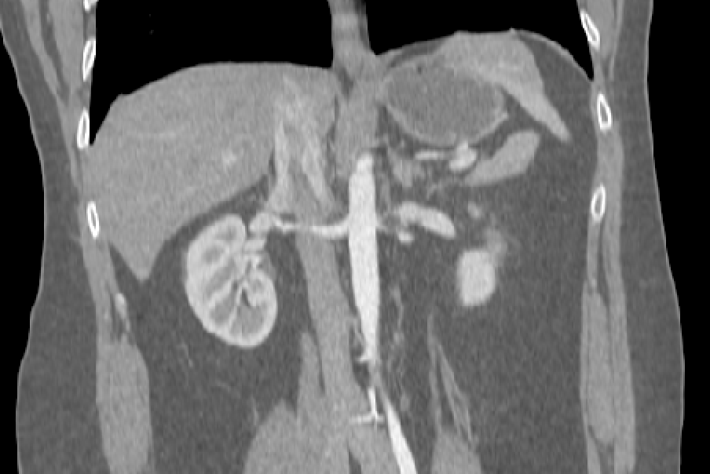

## Registration pipeline, Affine (Abdomen / 1/22/2020)

A working pipeline for Abdomen CT affine registration. NIFTIREG is used as registration engine. Please contact yucheng (yucheng.tang@vanderbilt.edu) for any issues.

### Methods

**Preprocessing**:

The following script is a collection of preprocessing substeps. Both moving and fixed images should be preprocessed before registration.

    # ${CONFIG_FILE} - configuration file (e.g. ./config/thorax_affine_example_20200103.sh)
    # ${IN_IMAGE} - input image to preprocess
    # ${OUT_IMAGE} - output image

Preprocessing:

If your image is not in abdomen ROI, refer to body part regression for generting body based ROI, and exclude region outside abdomen.

**Registration**

Co-registration between preprocessed moving and fixed images.

    # ${REG_TOOL_ROOT} - location of bin folder of nifti_reg
    # ${FIXED_IMAGE} - preprocessed fixed image
    # ${MOVING_IMAGE} - preprocessed moving image
    # ${OUTPUT_IMAGE} - registered image
    # ${OUTPUT_AFFINE_MATRIX} - affine matrix
    ${REG_TOOL_ROOT}/reg_aladin -ln 5 -ref ${FIXED_IMAGE} -flo ${MOVING_IMAGE} -res ${OUTPUT_IMAGE} -aff ${OUTPUT_AFFINE_MATRIX}

|  |   |  |
|:----------:|:-------------:|:------:|
|Moving image | Affine | Overlay |

### More examples

|Image 1| Image 2 | Image 3 | Image 4 | Image 5 | Reference | 
|:---:|:---:|:---:|:---:|:---:|:---:|
||  |  |  |  |  |
||  |  |  |  |  |
||  |  |  |  |  |
||  |  |  |  |  |
||  |  |  |  |  |
||  |  |  |  |  |

<!---
your comment goes here
and here

### Affine Template/Atlas (SPORE)

|Unregistered| Affine average | Variance (log) | Reference |
|:---:|:---:|:---:|:---:|
|||  ||
|||  ||
|||  ||

Note: 1 failed case out of 1473 scans.

-->

### Remarks on boundary handling of interpolation

Interpolation substeps related to intensity-nan boundary handling.

**Pad original image using nan**

    padding_image ${IM_RESAMPLE} ${IM_PAD} ${TEMP_FOLDER_PADDING} ${INTERP_ENV_VAL}
    ${C3D_ROOT}/c3d ${IM_PAD} -replace ${INTERP_ENV_VAL} nan -o ${IM_TO_NAN}
    

**Resample using cubic interpolation**

Using option 1) "-inter 3" cubic interpolation; 2) "-pad NaN" nan padding of niftireg.

    ${REG_TOOL_ROOT}/reg_resample -inter 3 -pad NaN -ref ${FIXED_IM} -flo ${IM_INTERP_PRE} -trans ${TRANS_MAT} -res ${INTERP_DIR}/${file_name}

