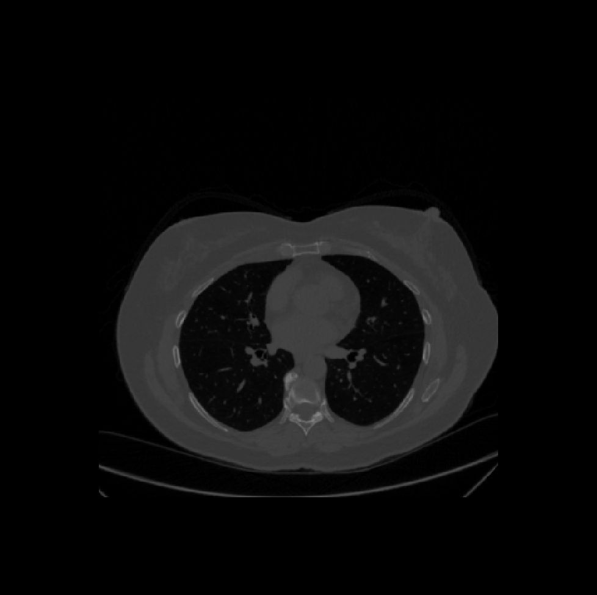
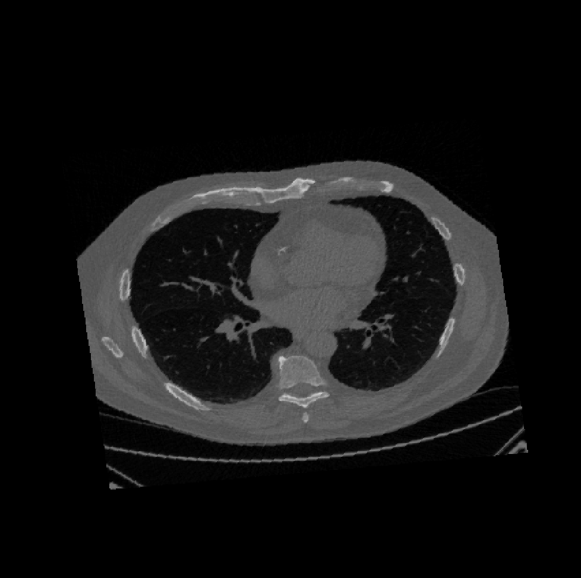
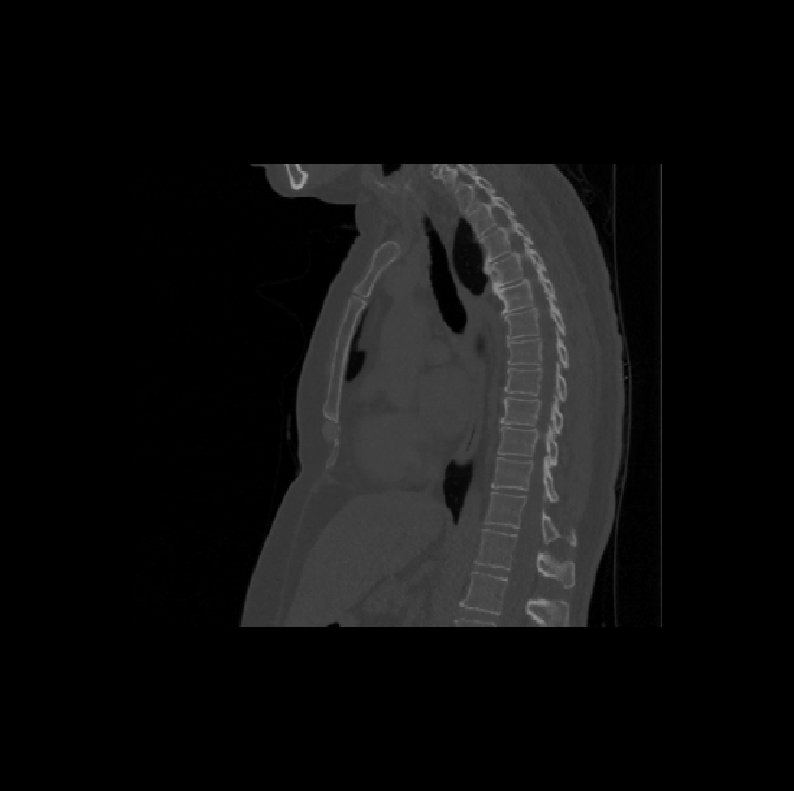
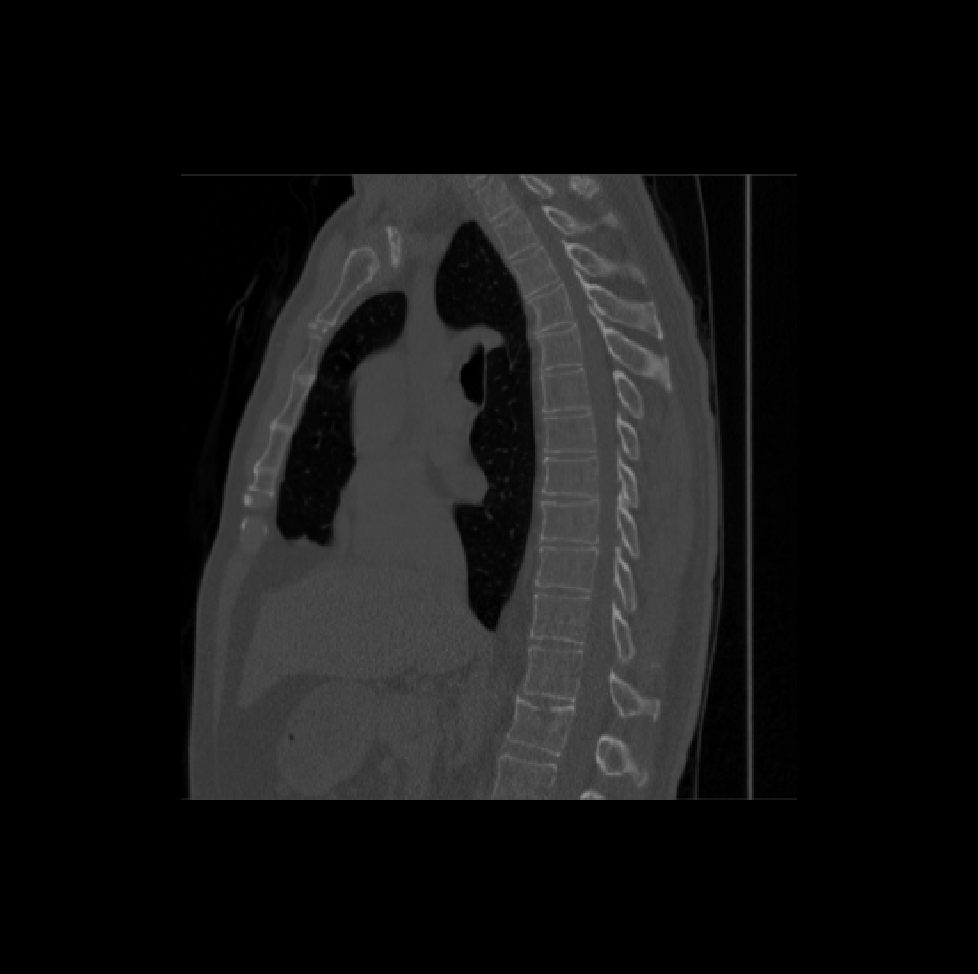

# Tutorial for Body/Thorax Registration
This repository includes the step-by-step instructions for body/thorax registration pipelines used in MASI lab. Both affine and non-rigid registration will be discussed. Examples are provided to validate each steps of the pipeline.

Please contact Kaiwen (kaiwen.xu@vanderbilt.edu) for any issues.

## Registration pipeline, Affine (Thorax LDCT, SPORE, 1/3/2020)

### Methods

**Preprocessing**:

Apply the following command to both moving and fixed images. Replace PATH_IN_IMAGE, PATH_OUT_IMAGE and TEMPORARY_FOLDER with actual locations.

    > ./tools/reg_preprocess.sh ./config/thorax_affine_example_20200103.sh PATH_IN_IMAGE PATH_OUT_IMAGE TEMPORARY_FOLDER

Preprocessing sub-steps:

Resampling to same resolution

    > ${FREESURFER_ROOT}/mri_convert -vs $SPACING_X $SPACING_Y $SPACING_Z ${IN_IM} ${OUT_IM}        

Body mask based on connected component analysis
    
    > ${PYTHON_ENV} ${SRC_ROOT}/tools/thorax_body_mask.py --in_image ${IN_IM} --out_mask ${MASK_IM} --out_image ${OUT_IM}

|  |   |  |
|:----------:|:-------------:|:------:|
| Resampled image   |      Body mask      | Apply body mask |

Generate lung segmentation based ROI mask, then clip on z direction. Registration tend to be more robust with this z roi clipping.

    > ${PYTHON_ENV} ${SRC_ROOT}/tools/seg_roi.py --method lung_seg_roi_z_mask --ori ${IN_IM} --mask ${LUNG_MASK_IM} --roi_region ${ROI_REGION_IM} --roi ${ROI_MASKED_IM} --fsl_root ${FSL_ROOT}

|  |   |  |
|:----------:|:-------------:|:------:|
|    |      z roi mask      | z-clipped |

Padding to same dimensions

    > ${FSL_ROOT}/fslmaths ${IN_IM} -add 1000 ${OUT_IM}
    > ${FSL_ROOT}/fslmaths ${IN_IM} -thr 0 ${OUT_IM}
    > ${PYTHON_ENV} ${SRC_ROOT}/tools/padding.py --ori ${IN_IM} --out ${OUT_IM} --dim_x ${DIM_X} --dim_y ${DIM_Y} --dim_z ${DIM_Z}
    > ${FSL_ROOT}/fslmaths ${IN_IM} -sub 1000 ${OUT_IM}

Intensity clipping [0, 1000] to eliminate boundary effect

    > ${FSL_ROOT}/fslmaths ${IN_IM} -thr 0 -sub 1000 -uthr 0 -add 1000 ${OUT_IM}

|  |   |  |
|:----------:|:-------------:|:------:|
|  |   |  |
|    |    ||

**Registration**

Co-registration between preprocessed moving and fixed images.

    > ${REG_TOOL_ROOT}/reg_aladin -ln 5 -ref FIXED_IMAGE -flo MOVING_IMAGE -res OUTPUT_IMAGE -aff OUTPUT_AFFINE_MATRIX

|  |   |  |
|:----------:|:-------------:|:------:|
|  |   |  |
|  |   |  |
|Moving image | Affine | fixed image|

**Interpolation**

Propagate the transformation (affine matrix) to original moving image using nearest neighbor interpolation under same coordinate space (i.e. with same resolution and boundary padding) 

    > ${SRC_ROOT}/ref_
    > ${REG_TOOL_ROOT}/reg_resample -inter 0 -pad -1000 -ref FIXED_IM -flo IN_IMAGE -trans TRANS_MATRIX -res OUT_IMAGE

- FIXED_IM = to provide the coordinate system of the resampled image.
- IN_IMAGE = input image to resample, should be resampled and padded into the same space as the images used in co-registration
- OUT_IMAGE = resampled image

|  |   |  |
|:----------:|:-------------:|:------:|
|  |   |  |
|  |   |  |
|Moving image | Affine | fixed image|

### More examples

|Image 1| Image 2 | Image 3 | Image 4 | Image 5 | Reference | 
|:---:|:---:|:---:|:---:|:---:|:---:|
||  |  |  |  |  |
||  |  |  |  |  |
||  |  |  |  |  |
||  |  |  |  |  |
||  |  |  |  |  |
||  |  |  |  |  |

### Affine Template/Atlas (SPORE)

|Unregistered| Affine | Reference |
|:---:|:---:|:---:|
||||
||||
||||

Note: 1 out of 1473 failed case.

## Registration pipeline, Non-rigid (Thorax LDCT, SPORE, 1/3/2020)

TODO

## Registration tools
Please refer to the review paper [1]. The full registration commands and configuration options can be found in the [supplementary materials](https://www.ncbi.nlm.nih.gov/pmc/articles/PMC4972188/bin/NIHMS805331-supplement-tbme-xu-2574816-mm_zip.zip) of [1].

###FSL
FMRIB Software Library (FSL) version 5.0
(http://fsl.fmrib.ox.ac.uk/fsldownloads/)

    # ${TARGETIMG} -target intensity image
    # ${SOURCEIMG} – source intensity image
    # ${SOURCELABEL} – source atlas label
    # ${RIGIDIMG} – rigid registered image
    # ${RIGIDTFM} – rigid registration transformation
    # ${AFFINEIMG} – affine registered image
    # ${AFFINETFM} – affine registration transformation
    # ${AFFINELABEL} – affine registered label
    # ${NONRIGIDIMG} – non-rigid registered image
    # ${NONRIGIDTFM} – non-rigid registration transformation
    # ${NONRIGIDLABEL} – non-rigid registered label

    # rigid image registration 
    flirt -v -dof 6 -in ${SOURCEIMG} -ref ${TARGETIMG} -omat ${RIGIDTFM} -out ${RIGIDIMG} -nosearch
    # affine image registration
     flirt -v -dof 9 -in ${SOURCEIMG} -ref ${TARGETIMG} -init ${RIGIDTFM} -omat ${AFFINETFM} -out ${AFFINEIMG} -nosearch
    # affine label propagation
    flirt -v -in ${SOURCELABEL} -ref ${TARGETIMG} -applyxfm -init ${AFFINETFM} -out ${AFFINELABEL} -interp nearestneighbour
    # non-rigid image registration
    fnirt -v --in=${SOURCEIMG} –ref=${TARGETIMG} –aff=${AFFINETFM} –cout=${NONRIGIDTFM} –iout=${NONRIGIDIMG}
    # non-rigid label propagation
    applywarp -v -i ${SOURCELABEL} -w ${NONRIGIDTFM} --interp=nn -r ${TARGETIMG} -o ${NONRIGIDLABEL}

###ANTS-CC
Advanced Normalization Tools (ANTs) version 1.9
(http://sourceforge.net/projects/advants/files/ANTS/)

    # ${TARGETIMG} -target intensity image
    # ${SOURCEIMG} – source intensity image
    # ${SOURCELABEL} – source atlas label
    # ${RIGIDTFMPREFIX} – prefix of rigid registration transformation
    # ${RIGIDTFM} – rigid registration transformation (RIGIDTFM=${RIGIDTFMPREFIX}0GenericAffine.mat)
    # ${AFFINETFMPREFIX} – prefix of affine registration transformation
    # ${AFFINETFM} – affine registration transformation (AFFINETFM=${AFFINETFMPREFIX}0GenericAffine.mat)
    # ${AFFINELABEL} – affine registered label
    # ${NONRIGIDTFMPREFIX} – prefix of non-rigid registration transformation
    # ${NONRIGIDTFMWARP} – non-rigid registration associated warping field (NONRIGIDTFMWARP=${NONRIGIDTFMPREFIX}1Warp.nii.gz)
    # ${NONRIGIDTFMAFFINE} – non-rigid registration associated affine transformation (NONRIGIDTFMAFFINE==${NONRIGIDTFMPREFIX}0GenericAffine.mat)
    # ${NONRIGIDLABEL} – non-rigid registered label
    
    # run with two CPU cores
    NUMBEROFTHREADS=2
    ORIGINALNUMBEROFTHREADS=${ITK_GLOBAL_DEFAULT_NUMBER_OF_THREADS}
    ITK_GLOBAL_DEFAULT_NUMBER_OF_THREADS=$NUMBEROFTHREADS
    export ITK_GLOBAL_DEFAULT_NUMBER_OF_THREADS
    # rigid image registration
    antsRegistration --dimensionality 3 --metric CC[${TARGETIMG},${SOURCEIMG},1,4] --interpolation Linear --transform Rigid[0.1] --initial-moving-transform [${TARGETIMG},${SOURCEIMG},1]  --winsorize-image-intensities [0.005,0.995] --convergence [1000x500x250x100,1e-6,10] --shrink-factors 12x8x4x2 --smoothing-sigmas 4x3x2x1vox --float --output ${RIGIDTFMPREFIX}
    # affine image registration
    antsRegistration --dimensionality 3 --metric CC[${TARGETIMG},${SOURCEIMG},1,4]  --interpolation Linear --transform Affine[0.1] --initial-moving-transform ${RIGIDTFM} --winsorize-image-intensities [0.005,0.995] --convergence [1000x500x250x100,1e-6,10] --shrink-factors 12x8x4x2 --smoothing-sigmas 4x3x2x1vox --float --output ${AFFINETFMPREFIX}
    # affine label propagation
    antsApplyTransforms --dimensionality 3 -i ${SOURCELABEL} -o ${AFFINELABEL} -r ${TARGETIMG} -t ${AFFINETFM} -n NearestNeighbor
    # non-rigid image registration
    antsRegistration --dimensionality 3 --metric [${TARGETIMG},${SOURCEIMG},1,4] --interpolation Linear --transform SyN[0.1,3,0] --initial-moving-transform ${AFFINETFM} --winsorize-image-intensities [0.005,0.995] --convergence [100x100x70x50x20,1e-6,10] --shrink-factors 10x6x4x2x1 --smoothing-sigmas 5x3x2x1x0vox --float --output ${NONRIGIDTFMPREFIX}
    # non-rigid label propagation
    antsApplyTransforms --dimensionality 3 -i ${SOURCELABEL} -o ${NONRIGIDLABEL} -r ${TARGETIMG} -t ${NONRIGIDTFMWARP} ${NONRIGIDTFMAFFINE} -n NearestNeighbor

###ANTS-QUICK-MI
Advanced Normalization Tools (ANTs) version 1.9
(http://sourceforge.net/projects/advants/files/ANTS/)

    # ${TARGETIMG} -target intensity image
    # ${SOURCEIMG} – source intensity image
    # ${SOURCELABEL} – source atlas label
    # ${RIGIDTFMPREFIX} – prefix of rigid registration transformation
    # ${RIGIDTFM} – rigid registration transformation (RIGIDTFM=${RIGIDTFMPREFIX}0GenericAffine.mat)
    # ${AFFINETFMPREFIX} – prefix of affine registration transformation
    # ${AFFINETFM} – affine registration transformation (AFFINETFM=${AFFINETFMPREFIX}0GenericAffine.mat)
    # ${AFFINELABEL} – affine registered label
    # ${NONRIGIDTFMPREFIX} – prefix of non-rigid registration transformation
    # ${NONRIGIDTFMWARP} – non-rigid registration associated warping field (NONRIGIDTFMWARP=${NONRIGIDTFMPREFIX}1Warp.nii.gz)
    # ${NONRIGIDTFMAFFINE} – non-rigid registration associated affine transformation (NONRIGIDTFMAFFINE==${NONRIGIDTFMPREFIX}0GenericAffine.mat)
    # ${NONRIGIDLABEL} – non-rigid registered label
    
    # run with two CPU cores
    NUMBEROFTHREADS=2
    ORIGINALNUMBEROFTHREADS=${ITK_GLOBAL_DEFAULT_NUMBER_OF_THREADS}
    ITK_GLOBAL_DEFAULT_NUMBER_OF_THREADS=$NUMBEROFTHREADS
    export ITK_GLOBAL_DEFAULT_NUMBER_OF_THREADS
    # rigid image registration
    antsRegistration --dimensionality 3 --metric MI[${TARGETIMG},${SOURCEIMG},1,32,REGULAR,0.25] --interpolation Linear --transform Rigid[0.1] --initial-moving-transform [${TARGETIMG},${SOURCEIMG},1]  --winsorize-image-intensities [0.005,0.995] --convergence [1000x500x250x0,1e-6,10] --shrink-factors 12x8x4x2 --smoothing-sigmas 4x3x2x1vox --float --output ${RIGIDTFMPREFIX}
    # affine image registration
    antsRegistration --dimensionality 3 --metric MI[${TARGETIMG},${SOURCEIMG},1,32,REGULAR,0.25]  --interpolation Linear --transform Affine[0.1] --initial-moving-transform ${RIGIDTFM} --winsorize-image-intensities [0.005,0.995] --convergence [1000x500x250x0,1e-6,10] --shrink-factors 12x8x4x2 --smoothing-sigmas 4x3x2x1vox --float --output ${AFFINETFMPREFIX}
    # affine label propagation
    antsApplyTransforms --dimensionality 3 -i ${SOURCELABEL} -o ${AFFINELABEL} -r ${TARGETIMG} -t ${AFFINETFM} -n NearestNeighbor
    # non-rigid image registration
    antsRegistration --dimensionality 3 --metric [${TARGETIMG},${SOURCEIMG},1,4] --interpolation Linear --transform SyN[0.1,3,0] --initial-moving-transform ${AFFINETFM} --winsorize-image-intensities [0.005,0.995] --convergence [100x100x70x50x0,1e-6,10] --shrink-factors 10x6x4x2x1 --smoothing-sigmas 5x3x2x1x0vox --float --output ${NONRIGIDTFMPREFIX}
    # non-rigid label propagation
    antsApplyTransforms --dimensionality 3 -i ${SOURCELABEL} -o ${NONRIGIDLABEL} -r ${TARGETIMG} -t ${NONRIGIDTFMWARP} ${NONRIGIDTFMAFFINE} -n NearestNeighbor

###IRTK
Image Registration Toolkit (IRTK) version 2.0
(http://www.doc.ic.ac.uk/~dr/software/download.html)

    # ${TARGETIMG} -target intensity image
    # ${SOURCEIMG} – source intensity image
    # ${SOURCELABEL} – source atlas label
    # ${RIGIDIMG} – rigid registered image
    # ${RIGIDTFM} – rigid registration transformation
    # ${AFFINETFM} – affine registration transformation
    # ${AFFINELABEL} – affine registered label
    # ${NONRIGIDTFM} – non-rigid registration transformation
    # ${NONRIGIDLABEL} – non-rigid registered label
    
    # rigid image registration 
    rreg ${TARGETIMG} ${SOURCEIMG} -dofout ${RIGIDTFM} -translation_only -Tp -900
    # affine image registration
    areg ${TARGETIMG} ${SOURCEIMG} -dofin ${RIGIDTFM} -dofout ${AFFINETFM} -translation_scale –Tp -900
    # affine label propagation
    transformation ${SOURCELABEL} ${AFFINELABEL} -dofin ${AFFINETFM} -target ${TARGETIMG} -nn -matchInputType
    # non-rigid image registration
    nreg ${TARGETIMG} ${SOURCEIMG} -dofin ${AFFINETFM} -dofout ${NONRIGIDTFM} -Tp -900 -ds 20
    # non-rigid label propagation
    transformation ${SOURCELABEL} ${NONRIGIDLABEL} -dofin ${NONRIGIDTFM} -target ${TARGETIMG} -nn –matchInputType

###NIFTYREG
NiftyReg, version with the 390df2baaf809a625ed5afe0dbc81ca6a3f7c647 Git hash
(http://sourceforge.net/p/niftyreg/git/ci/master/tree/)

    # ${TARGETIMG} -target intensity image
    # ${SOURCEIMG} – source intensity image
    # ${SOURCELABEL} – source atlas label
    # ${AFFINEIMG} – affine registered image
    # ${AFFINETFM} – affine registration transformation
    # ${AFFINELABEL} – affine registered label
    # ${NONRIGIDIMG} – non-rigid registered image
    # ${NONRIGIDTFM} – non-rigid registration transformation
    # ${NONRIGIDLABEL} – non-rigid registered label
    
    # affine image registration
    reg_aladin -ln 5 -omp 2 -ref ${TARGETIMG} -flo ${SOURCEIMG} -res ${AFFINEIMG} -aff ${AFFINETFM} 
    # affine label propagation
    reg_resample -inter 0 -ref ${TARGETIMG} -flo ${SOURCELABEL} -trans ${AFFINETFM} -res ${AFFINELABEL} 
    # non-rigid image registration
    reg_f3d -ln 5 --rUpTh 500 --fUpTh 500 -omp 2 -maxit 1000 -ref ${TARGETIMG} -flo ${SOURCEIMG} -aff ${AFFINETFM} -cpp ${NONRIGIDTFM} -res ${NONRIGIDIMG}
    # non-rigid label propagation
    reg_resample -inter 0 -ref ${TARGETIMG} -flo ${SOURCELABEL} -trans ${NONRIGIDTFM} -res ${NONRIGIDLABEL}

###DEEDS
DEnsE Displacement Sampling (http://mpheinrich.de/software.html)
All parameters are internally defined. Please contact heinrich@imi.uni-luebeck.de for additional information.

# References
[1] Xu, Z., Lee, C. P., Heinrich, M. P., Modat, M., Rueckert, D., Ourselin, S., … Landman, B. A. (2016). Evaluation of Six Registration Methods for the Human Abdomen on Clinically Acquired CT. IEEE Transactions on Biomedical Engineering, 63(8), 1563–1572. https://doi.org/10.1109/TBME.2016.2574816