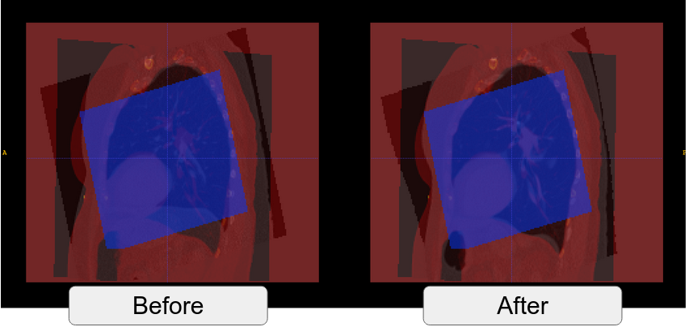
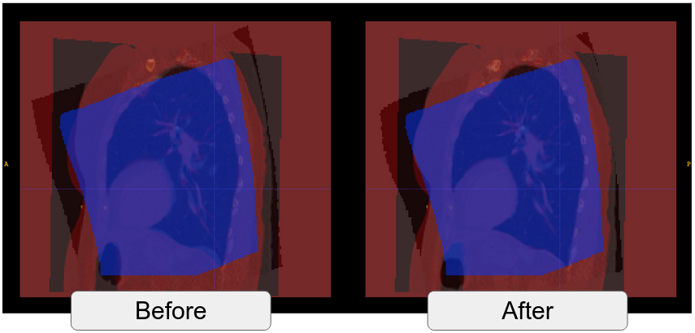
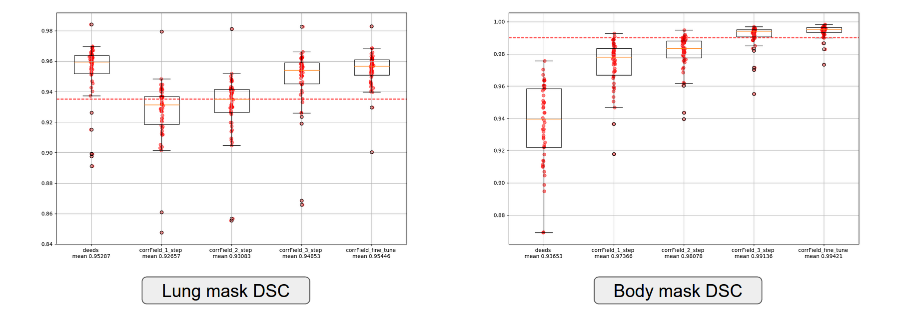

# Registration with Scan-adaptive Irregular ROI Masks

## Issues with deedsBCV Pipeline

The major difficulty for the deeds pipeline is how to handle the problem of scan specified irregular valid regions.
NaN voxels, voxels without meaningful intensity, are introduced to the field-of-view after affine registration. 
These voxels must be excluded before feeding the scans into the registration engine. 
The solution was to find a small lung segmentation based ROI region that can include most interested intensity information for later analysis, 
and at the same time to exclude the nan-voxels. 
Then the voxels outside the region were imputed with the ambient intensity.
However, this approximation can lead to registration flaws near the boundary region.

**Issues due to boundary approximation**


## corrField - Registration with Irregular ROI Mask

corrField provides the flexibility to restrict registration in a certain ROI.
Given a mask on the fixed image, the registration is initialized by sampling
key-points in the marked region with a certain criteria. The optimal correspondence
on the moving scan of these key-points are located us.pnging similar discrete optimization algorithm
as deeds. Then the registration of entire field-of-view is driven by these control points 
using Thin Plate Spline interpolation.


In this example, lung segmentation is used as the input mask.
Since our task is to register the whole thorax space, 
we need to design a mask that cover all effective information provided 
by the input scans.

## Scan-adaptive Effective Registration Region

The valid region (non-nan) is different for each affine warped scan.
This is caused by the variation of subject positioning while taking the CT scan,
and is an issue that need to be taken in to consideration when designing an algorithm that targeted 
for entire thoracic space. 
For this reason, the registration masks are designed to be scan-adaptive.

The target is to include as many voxels as possible 
on both reference and moving scans, with the restriction that 
NaN voxels should be excluded from being used for registration.
To achieve this, we need to consider the domain of definition for 
correspondence determination procedure of each key-point.
For reference space, this region is defined by the stencil for self-similarity context (SSC) [1].
On moving scan, this region
is an area with radius **R** that determined by the summation of **searching radius** (-L),
**patch radius for similarity** (-R) and **stencil radius for self-similarity context (SSC)**.
Then, the valid region for key-points can be defined as all
voxels that having the distance to the valid region boundary larger than **R**. .
This can be achieved by a distance transformation followed by a thresholding in practice
The intersection of the key-point valid regions on both moving and reference space 
form the registration mask for corrField.


## A Coarse-to-fine Approach

The difficult with the single registration step is the trade-off between 
the size of effective registration region and the capability 
to capture large intro/inner subject structure variations.
With small search radius (e.g. less than 20mm), the registration
cannot capture large anatomical variations like the location of the Diaphrams.
But on the other hand, increasing searching radius will lead to a reduction
of the size of effective registration region.

A multi-level coarse-to-fine approach is developed to solve the problem.
First, a large search radius is used to cover the most significant
anatomical variation, e.g. about 20mm for diaphram. The the transformation
is interpolated from key-points to all voxels by the TPS.
In next iteration, we use a smaller searching radius, e.g. 26mm.
The warped image of previous step will serve as the moving image.
The valid region is also deformed as with the moving scan. The process is
repeated until adequate portion the valid region is included. In our case,
it is 16mm.

The plausibility of this design based on several assumptions:

1. The registration result inside the effective mask is trustworthy.
2. The anatomical variation is continuous spatially. With this assumption, 
   by TPS interpolation, once the region marked by the effective mask 
   are well aligned, the variation in a small neighborhood of the region is also
   largely mitigated. Thus the reduced search radius can work in the new 
   effective region for next iteration.
3. Leaving out a small curved slab near the boundary region
   won't harm down stream tasks, e.g. the important regions of interest are always at
   the center part of the valid region.
 
**Initial step (R = 32mm):**



**Reduced searching radius (R = 16mm), enlarge the effective region:**



## Experiments and Results

A corrField based 3 step procedure is implemented. Tested on a VLSP sub-dataset 
with 50 affine co-registered scans.

**Compare with deeds baseline**

| Method           	| Dice (Lung) 	| Dice (Body) 	|
|------------------	|-------------	|-------------	|
| deeds            	| 0.95287     	| 0.93653     	|
| corrField step 1 	| 0.92657     	| 0.97365     	|
| corrField step 2 	| 0.93083     	| 0.98077     	|
| corrField step 3 	| 0.94853     	| 0.99135     	|




**Configuration of each step**

| Step   	| Resolution (mm) 	| Search Radius (mm) 	| Keypoint dispersion (mm) 	| Regularization 	| Effective radius (mm) 	|
|--------	|-----------------	|--------------------	|--------------------------	|----------------	|-----------------------	|
| Step 1 	|           2x2x2 	|                 20 	|                       20 	|              1 	|                    32 	|
| Step 2 	|           2x2x2 	|                 10 	|                       12 	|            0.5 	|                    22 	|
| Step 3 	|           1x1x1 	|                 10 	|                       10 	|            0.1 	|                    16 	|

## Implementation

#### Code
```
https://github.com/MASILab/ThoraxNonRigid/tree/release_corrField_eval
```

#### Demo data folder 
```
/nfs/masi/registration_demo_data/thorax/non_rigid/corrField_eval
```

#### Run corrField 3 step version

```
$ /nfs/masi/registration_demo_data/thorax/non_rigid/corrField_eval/corrField_3_step/run.sh
```

## References

[1] Heinrich, M. P., Jenkinson, M., Papiez, B. W., Brady, S. M., & Schnabel, J. A. (2013). Towards realtime multimodal fusion for image-guided interventions using self-similarities. Lecture Notes in Computer Science (Including Subseries Lecture Notes in Artificial Intelligence and Lecture Notes in Bioinformatics), 8149 LNCS(PART 1), 187–194. https://doi.org/10.1007/978-3-642-40811-3_24

[2] Ruhaak, J., Polzin, T., Heldmann, S., Simpson, I. J. A., Handels, H., Modersitzki, J., & Heinrich, M. P. (2017). Estimation of Large Motion in Lung CT by Integrating Regularized Keypoint Correspondences into Dense Deformable Registration. IEEE Transactions on Medical Imaging, 36(8), 1746–1757. https://doi.org/10.1109/TMI.2017.2691259 

 

  
 