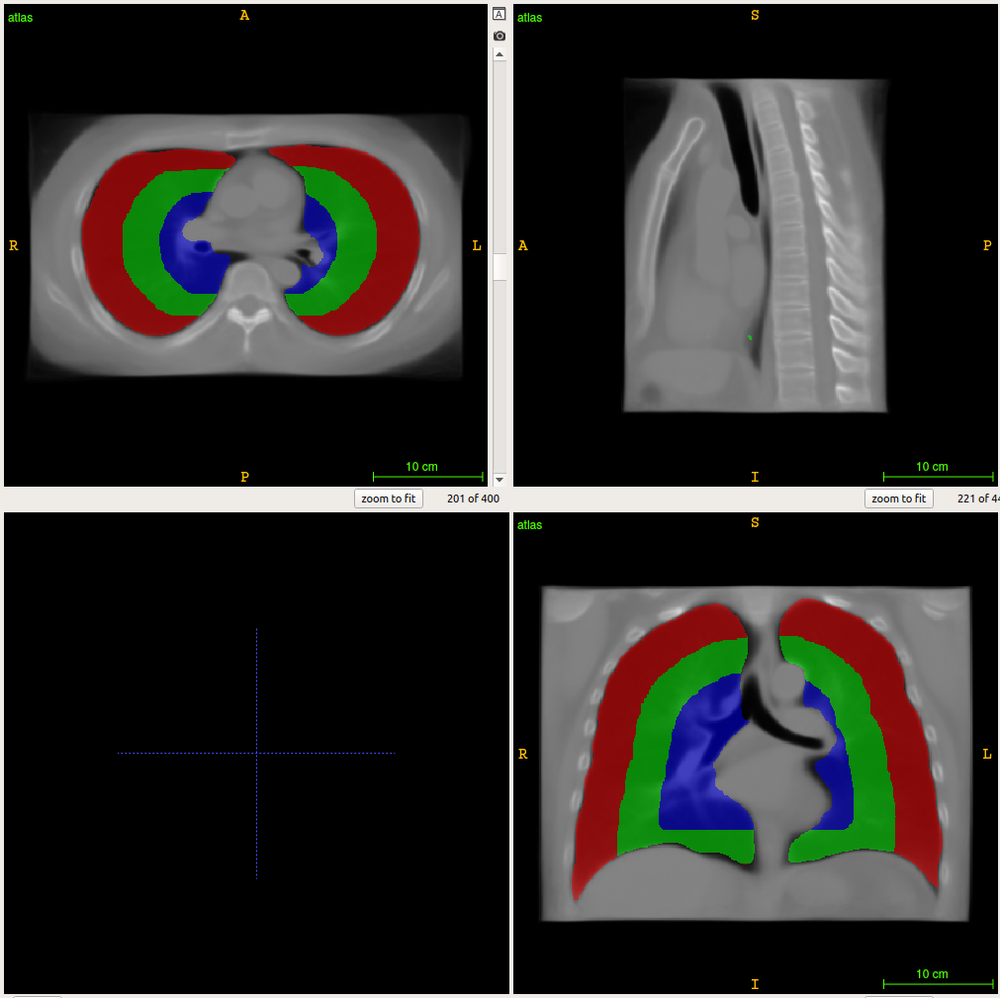
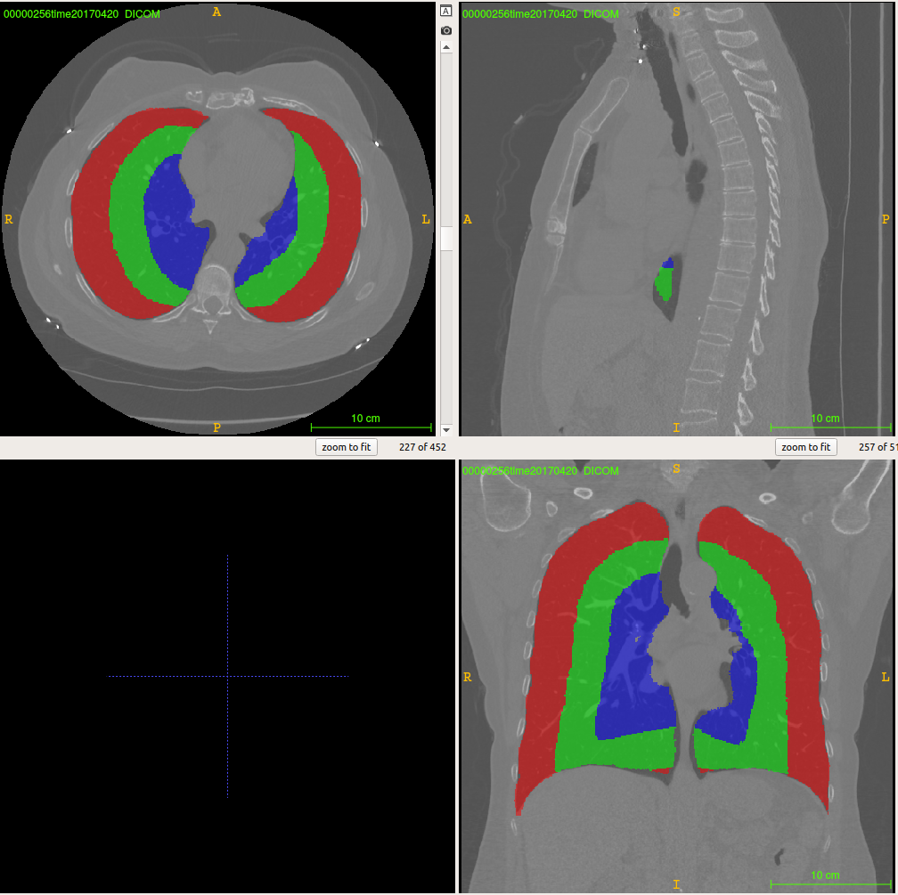

## Non-rigid Atlas Label Propagation (Thorax LDCT, SPORE, 2/13/2020)
In this section, we describe a working pipeline to propagate label map from atlas space to target image space. The pipeline is built based on NIFTYREG toolset.

    Input:
    Target scan(s)
    Non-rigid atlas
    Label map on atlas
    
    Output:
    Label map(s) propagated on target scans
     

### Preprocessing
The same Lung mask ROI cropping preprocessing pipeline as in [deformable_deedsBCV](./thorax_deformable_deedsBCV/readme.md).

### Registration
Non-rigid registration is initialized by the first step affine registration. 
    
    # ${TARGETIMG} – target intensity image
    # ${ATLASIMG} – Non-rigid atlas image
    # ${AFFINEIMG} – affine registered image
    # ${AFFINETFM} – affine registration transformation
    # ${NONRIGIDIMG} – non-rigid registered image
    # ${NONRIGIDTFM} – non-rigid registration transformation
    # ${NUMPROCESSES} – number of processes
    
    # affine image registration
    ${NIFYREG_ROOT}/reg_aladin -ln 5 -omp ${NUMPROCESSES} -ref ${ATLASIMG} -flo ${TARGETIMG} -res ${AFFINEIMG} -aff ${AFFINETFM}
    
    # non-rigid image registration
    ${NIFYREG_ROOT}/reg_f3d -ln 5 -omp ${NUMPROCESSES} -maxit 1000 -sx 10 -ref ${ATLASIMG} -flo ${TARGETIMG} -aff ${AFFINETFM} -cpp ${NONRIGIDTFM} -res ${NONRIGIDIMG}

### Inversion of non-rigid transformation fields

    # ${ATLASLABELIMG} – Label map on atlas space
    # ${NONRIGIDTFMINVERSE} – Inverse of non-rigid registrtion transformation
    ${NIFYREG_ROOT}/reg_transform -omp ${NUMPROCESSES} -ref ${ATLASLABELIMG} -invNrr ${NONRIGIDTFM} ${ATLASLABELIMG} ${NONRIGIDTFMINVERSE} 

### Resample label map to the space of target image

    # ${TARGETLABELIMG} – Label map back-propagated to the target scan space
    # -inter 0 – Nearest-neighbor interpolation 
    ${NIFYREG_ROOT}/reg_resample -omp ${NUMPROCESSES} -inter 0 -pad 0 -ref ${TARGETIMG} -flo ${ATLASLABELIMG} -trans ${NONRIGIDTFMINVERSE} -res ${TARGETLABELIMG}

## Demo

### Run demo script

    # ${PROJ_ROOT} -- Root of project
    git clone https://github.com/MASILab/registration_tutorial.git ${PROJ_ROOT}
    bash ${PROJ_ROOT}/thorax_deformable_niftyreg/run_demo.sh
    
The script apply the pipeline on 5 demo scans from SPORE dataset are under location

    /nfs/masi/registration_demo_data/thorax/non_rigid_niftyreg/demo_scan_nii

Atlas and label (1/3 lung label maps) files are under location

    /nfs/masi/registration_demo_data/thorax/non_rigid_niftyreg/atlas

    
The generated label maps are under 

    ${PROJ_ROOT}/thorax_deformable_niftyreg/demo_output/out
    
### Example

#### Atlas and label map on atlas space

    
#### Label map propagated to the target image space

