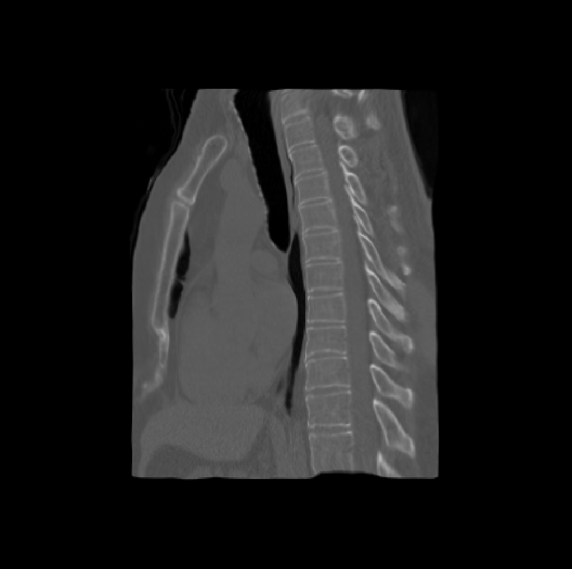
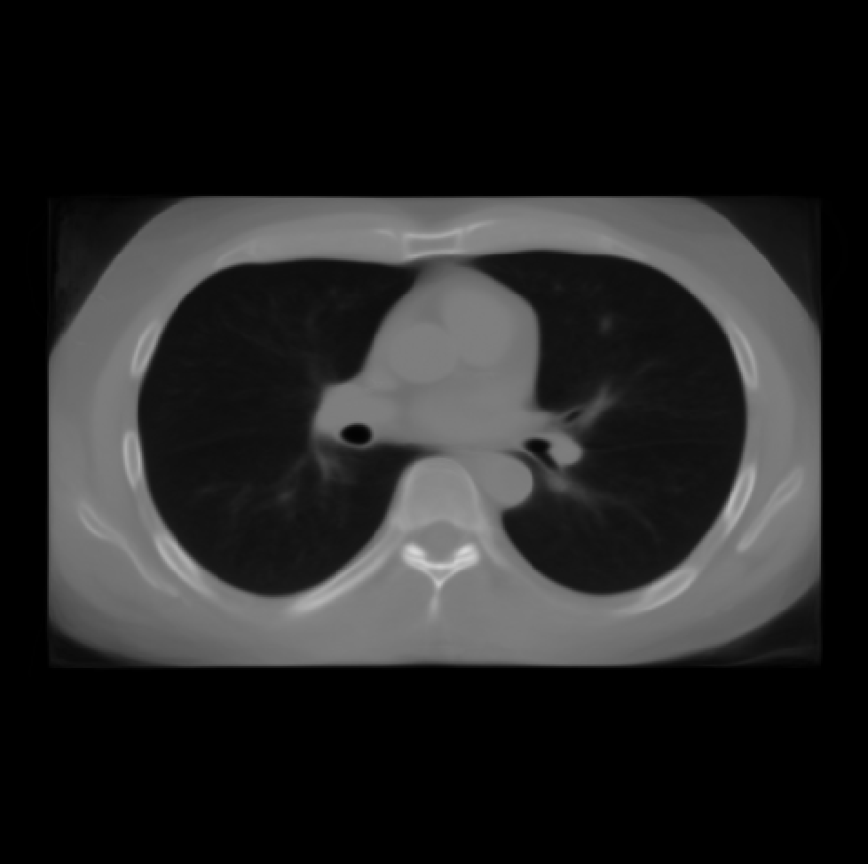

## Registration pipeline, non-rigid (Thorax LDCT, SPORE, 1/6/2020)

A working pipeline for non-rigid registration of Thorax CT. The pipeline is based on DeedsBCV.
Please contact Kaiwen (kaiwen.xu@vanderbilt.edu) for any issues.

### Methods

**Preprocessing**:

    # ${CONFIG_FILE} - configuration file (e.g. ./config/thorax_nonrigid_example_20200108.sh)
    # ${IN_IMAGE} - input image to preprocess
    # ${OUT_IMAGE} - output image
    # ${TEMP_FOLDER} - location for files of each preprocess substep  
    ./tools/reg_preprocess.sh ${CONFIG_FILE} ${IN_IMAGE} ${OUT_IMAGE} ${TEMP_FOLDER}
    
Preprocessing sub-steps:

Resampling to same resolution

    ${FREESURFER_ROOT}/mri_convert -vs $SPACING_X $SPACING_Y $SPACING_Z ${IN_IM} ${OUT_IM}
    
ROI cropping based on lung segmentation

    ${PYTHON_ENV} ${SRC_ROOT}/tools/seg_roi.py --method lung_seg_roi_clip_full --ori ${IN_IM} --mask ${LUNG_MASK_IM} --roi_region ${ROI_REGION_IM} --roi ${ROI_MASKED_IM} --fsl_root ${FSL_ROOT}
    
|  |   |  |
|:----------:|:-------------:|:------:|
|    |      roi mask      | cropped |
    
Padding to same dimensions

    ${FSL_ROOT}/fslmaths ${IN_IM} -add 1000 ${OUT_IM}
    ${FSL_ROOT}/fslmaths ${IN_IM} -thr 0 ${OUT_IM}
    ${PYTHON_ENV} ${SRC_ROOT}/tools/padding.py --ori ${IN_IM} --out ${OUT_IM} --dim_x ${DIM_X} --dim_y ${DIM_Y} --dim_z ${DIM_Z}
    ${FSL_ROOT}/fslmaths ${IN_IM} -sub 1000 ${OUT_IM}
    
**Registration**

Co-registration between preprocessed moving and fixed images.

    # ${REG_TOOL_ROOT} - location of deedsBCV
    # ${FIXED_IMAGE} - preprocessed fixed image
    # ${MOVING_IMAGE} - preprocessed moving image
    # ${OUTPUT_IMAGE} - registered image
    # ${OUTPUT_AFFINE_MATRIX} - name of affine matrix (without extension)
    ${REG_TOOL_ROOT}/linearBCV -F ${FIXED_IMAGE} -M ${MOVING_IMAGE} -O ${OUTPUT_AFFINE_MATRIX}
    ${REG_TOOL_ROOT}/deedsBCV -F ${FIXED_IMAGE} -M ${MOVING_IMAGE} -O ${OUTPUT_IMAGE} -A ${OUTPUT_AFFINE_MATRIX}_matrix.txt
    
|Image 1| Image 2 | Image 3 | Image 4 | Image 5 | Reference | 
|:---:|:---:|:---:|:---:|:---:|:---:|
||  |  |  |  |  |
||  |  |  |  |  |
||  |  |  |  |  |
||  |  |  |  |  |
||  |  |  |  |  |
||  |  |  |  |  |

**Non-rigid Template/Atlas (SPORE 100 scans)**

| Average | Reference|
|:---:|:---:|
|  |  |
|  |  |
|  |  |
